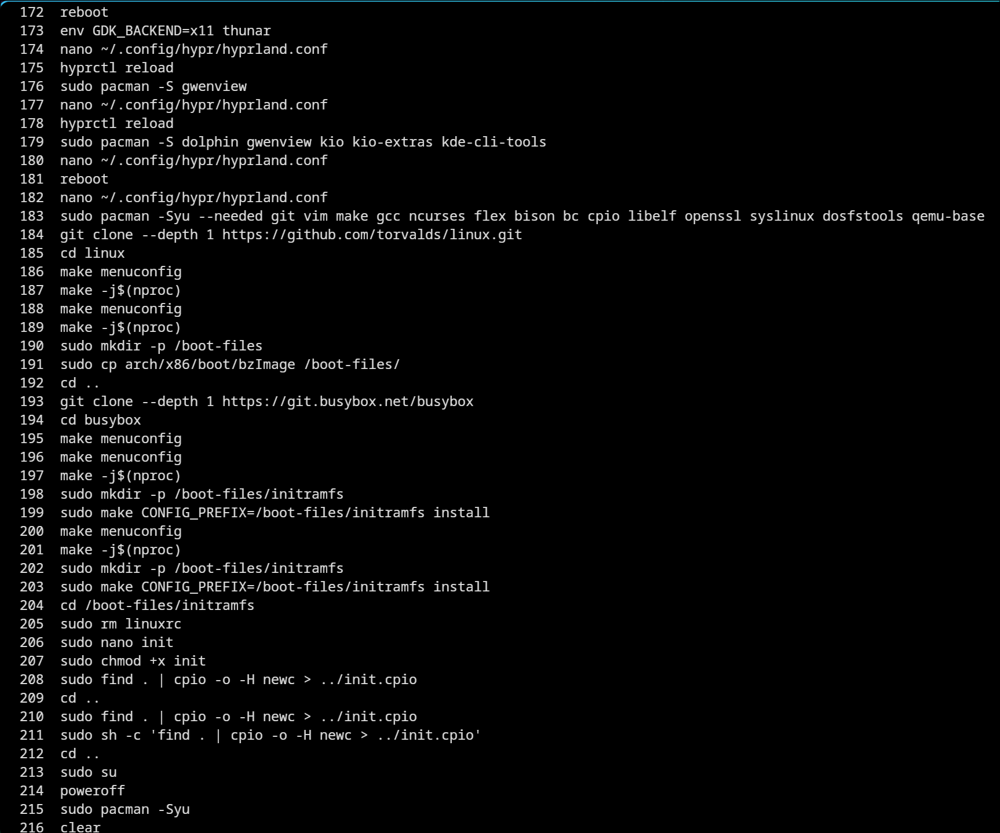
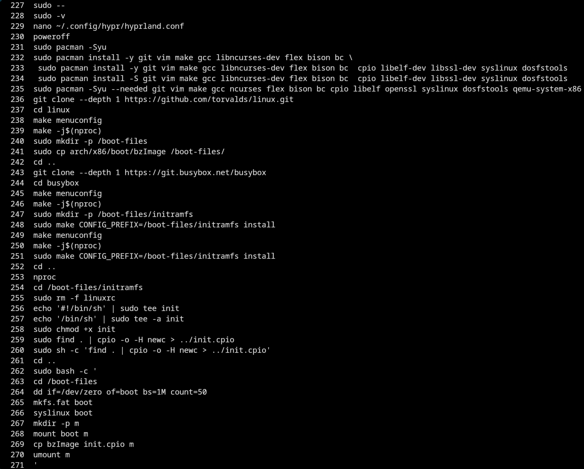
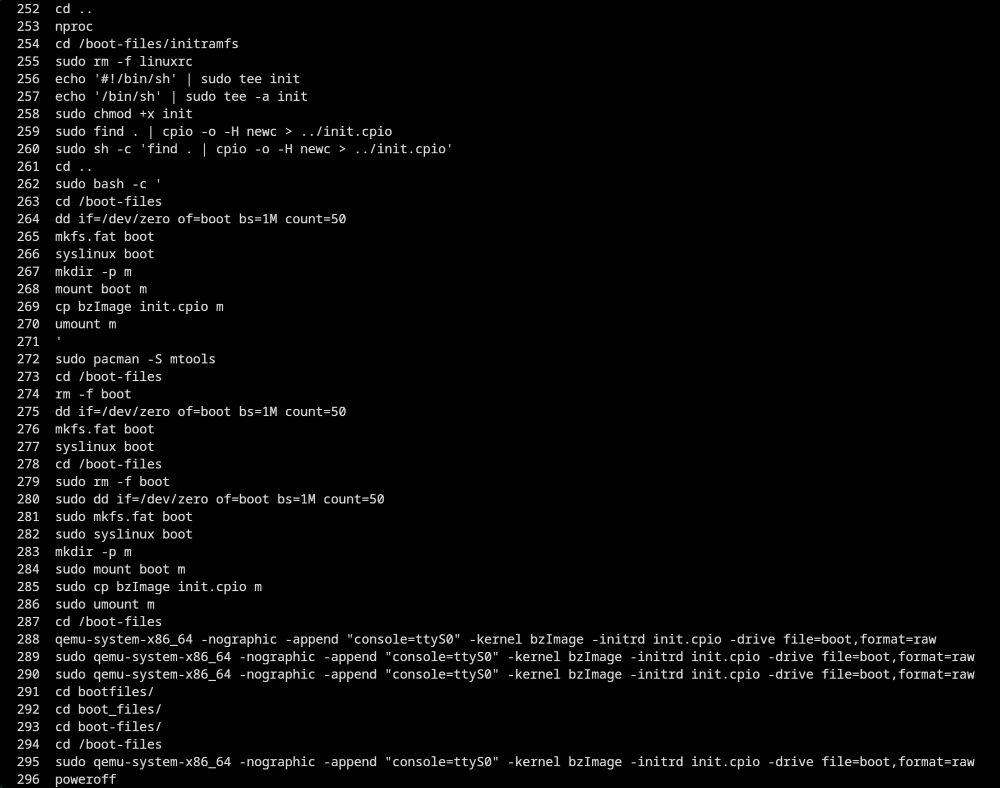
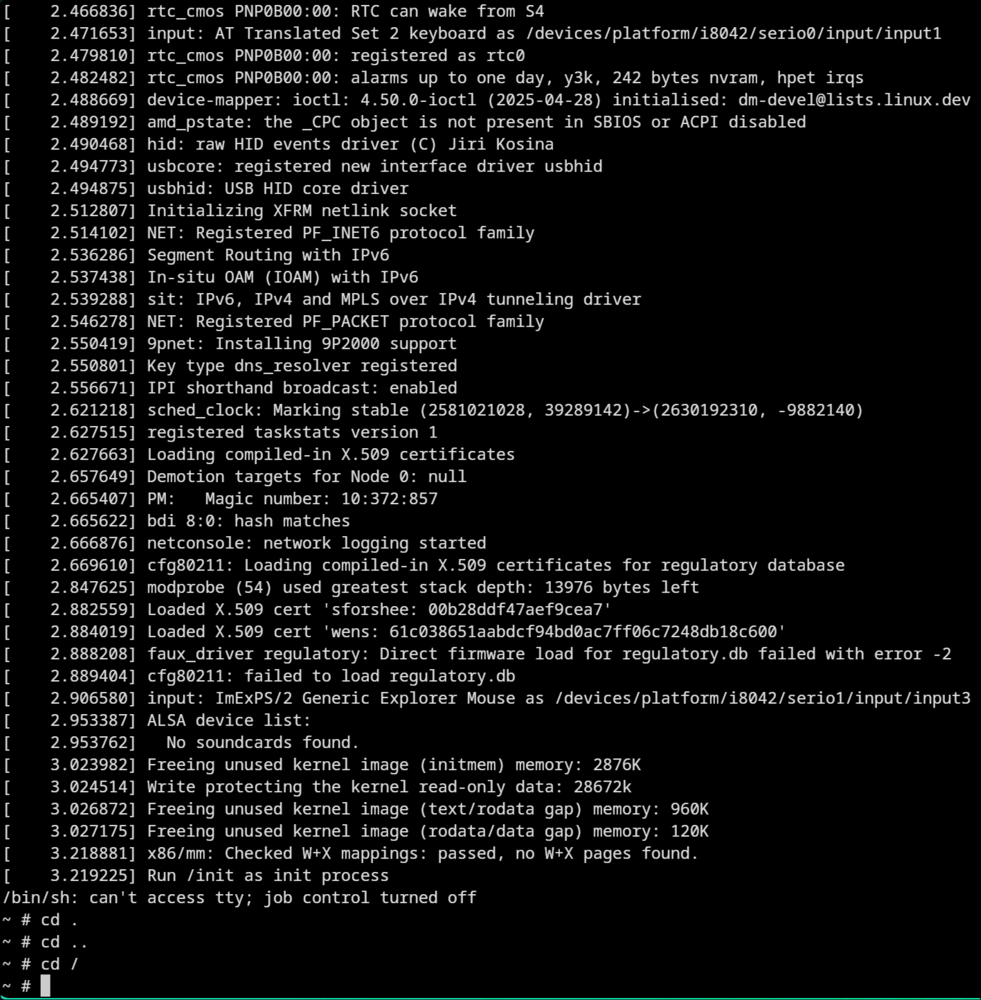
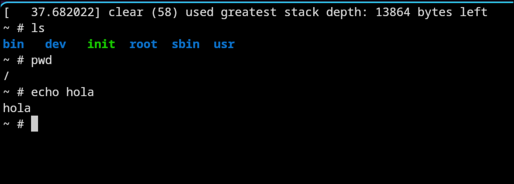
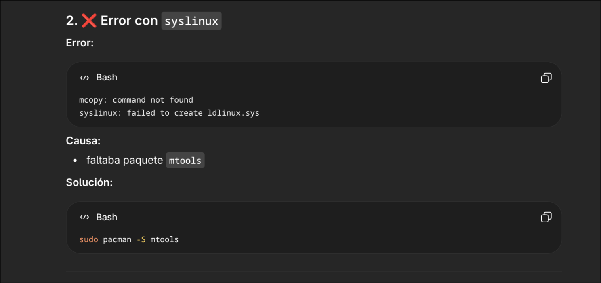
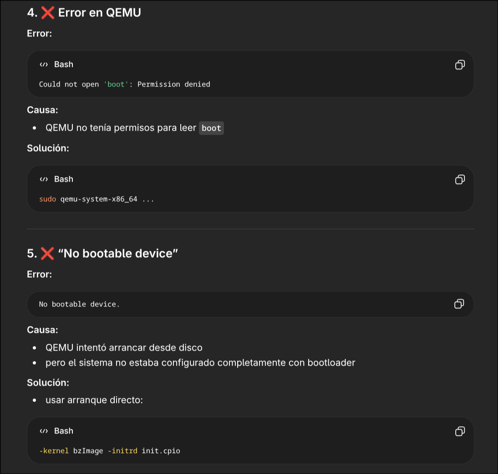

# UNIX-02-SIN-B-Mar-Jul-2026
Repo for the subject intoduction to unix

 -> initial attempt
 -> repeated attempt due to system issues
 -> Linux system running
 -> inside the minimal distribution
 -> command execution
 -> errors resolved with ChatGPT assistance
 -> errors resolved with ChatGPT assistance

**Asunto: Justificación de inasistencia**

Estimado profesor Jonathan Eduardo Tito Ontaneda:

Por medio de la presente, informo que el día lunes 6 de abril no pude asistir a clases debido a que tuve que presentarme a una audiencia judicial relacionada con un proceso de pensión de alimentos.

Dicha diligencia era de carácter obligatorio y no podía ser reprogramada, por lo que me fue imposible cumplir con mis actividades académicas en esa fecha.

Agradezco su comprensión.

Atentamente,
Arthur Beltran
